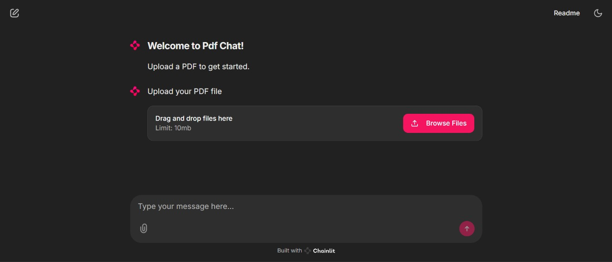
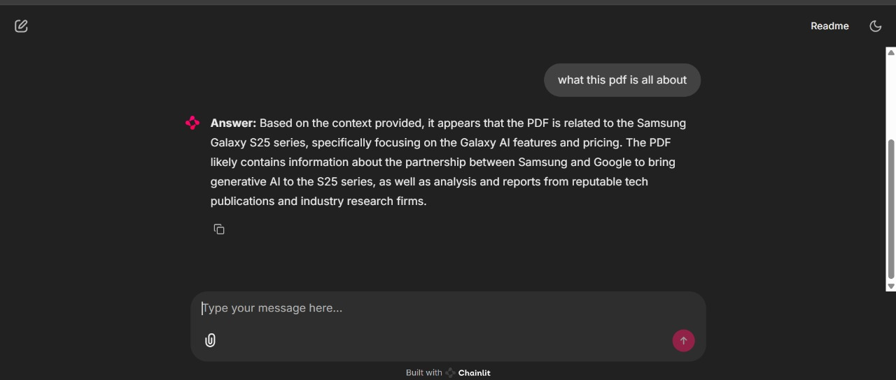

# 📄 Welcome to PDF Chatbot – Powered by Chainlit + Groq

Welcome to **PDF Chatbot**, an interactive AI assistant that lets you **upload a PDF** and **chat with it** in real-time! Built using ⚙️ Chainlit, 🚀 LangChain, 🧠 Groq’s LLaMA 3, and 💾 FAISS for vector storage.

---

## 🔍 Features

- 📁 Upload any PDF document (up to 10MB)
- 💡 Extract and chunk content using LangChain’s `RecursiveCharacterTextSplitter`
- 🔍 Perform semantic search using FAISS
- 🤖 Ask questions about the document
- ⚡ Get lightning-fast answers using **Groq’s LLaMA3-70B**

---

## 🧱 Tech Stack

| Tool            | Purpose                                 |
|-----------------|------------------------------------------|
| 🧠 **Groq + LangChain** | LLM-based Q&A over vector-retrieved text |
| 🧾 **PyPDF2**         | PDF parsing and text extraction      |
| 📊 **FAISS**           | Vector search for semantic matching |
| 💬 **Chainlit**        | UI + chat interface                 |
| 🧬 **Sentence Transformers** | Text embeddings (MiniLM-L6-v2)   |

---

## 🚀 Getting Started

### 🔧 1. Clone this repository

```bash
git clone https://github.com/pathakpriyanshu/RAG_PDF_CHATBOT.git
cd RAG_PDF_CHATBOT
```

### 📦 2. Install requirements

```bash
pip install -r requirements.txt
```

### 🔐 3. Set up environment variables

Create a `.env` file in the root:

```env
GROQ_API_KEY=your_groq_api_key_here
```

### ▶️ 4. Run the app locally

```bash
chainlit run app.py -w
```

Then open [http://localhost:8000](http://localhost:8000) in your browser.

---


## 🧪 Example Use Cases

- Ask questions about your resume
- Analyze research papers
- Query financial reports
- Understand legal documents

---

## 📸 Screenshots
# 1. Start


# 2. Uploading of PDF


# 3. Asking query



